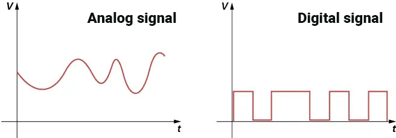
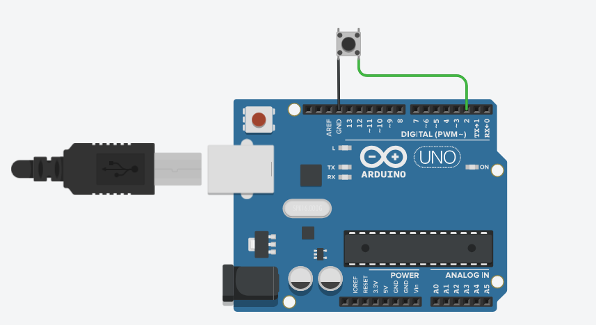
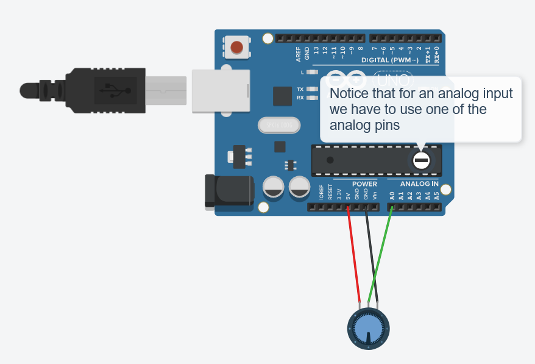
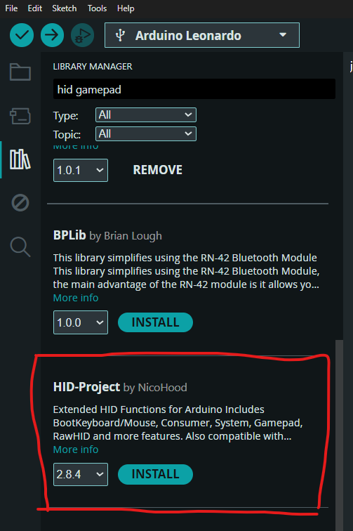

## inputs

Anything can be an input for a controller! As long as it can be perceived by our Arduino as either an analog or a digital signal.

> 
>
> Both of the graphs show an electric signal (a change of voltage over time)  
> The analog signal is continuous: the voltage has a variety of different values  
> The digital signal is discrete: it can only have two states (HIGH or LOW)

Arduino has two functions with which we can read the voltage on its pins:

- `digitalRead()`
  This will read the electric signal on the selected pin and interpret it as either a HIGH (1) or LOW (0) value, representing a binary signal (1 bit).
  This is ideal for inputs that behave like a "switch": such as a button in the case of our controller.

- `analogRead()`
  This will read the electric signal on the selected analog pin and interpret it as a number in the range of 0-1023 (a 10-bit integer).
  This is useful for components like joysticks and potentiometers (knobs).

- **Arduino libraries** 
  We can use external packages to have our Arduino interpret the signals of some more complex electrical components. Some nice people on the internet have already done most of the work for us and published functions we can use to interface with other hardware. See some of the examples here: https://github.com/softpack6ix/shapeshifters-winterschool/tree/main?tab=readme-ov-file#code-examples

## output

To be able to use our Arduino as a controller, we need to make it output a signal that can be perceived by our computer. Arduinos that support USB client mode (such as Arduino Pro Micro or Uno R4) can be used to emulate a Human Interface Device (HID). For our code examples, we use a library called HID-Project which can make our Arduino be perceived as any of the following input devices:
Keyboard, Mouse, Gamepad, MIDI, Consumer (Media player, browser, special programs), System (start/shutdown PC), Raw HID (create your own low-level HID device)

wiki: https://github.com/NicoHood/HID/wiki

- bonus: create a Bluetooth HID

If you want to experiment with a wireless controller, you can use an ESP (such as the D1 mini) to create a Bluetooth HID device.
